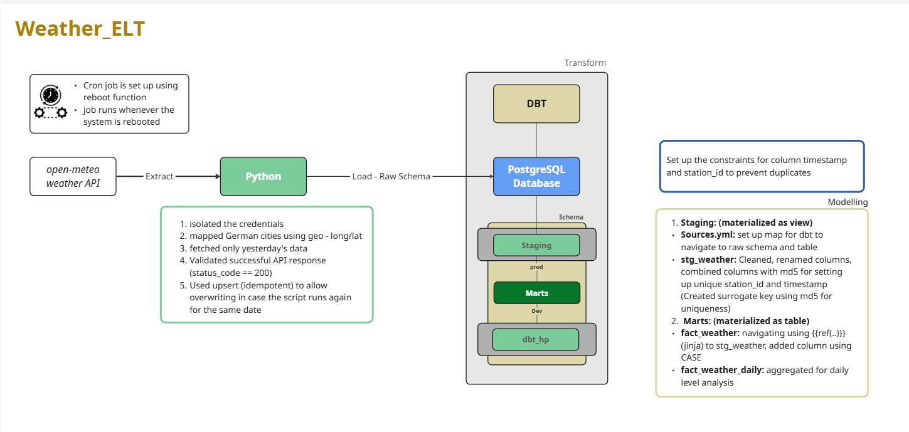

# Weather ELT Pipeline


Fully automated ELT pipeline fetching daily weather data for 10 German cities from the OpenWeatherMap API. A Bash master script tied to `@reboot` cron handles the full cycle without any manual intervention — the pipeline wakes itself up when the machine starts.

- Extraction script — [extract.py](extract.py)
- dbt project — [weather_transform/](weather_transform/)
- Automation script — [run_pipeline.sh](run_pipeline.sh)

---

## Architecture



```
OpenWeatherMap API (10 German cities)
    │
    ▼ extract.py  (Pandas + Requests)
Local PostgreSQL — raw schema
    │
    ▼ dbt (weather_transform/)
Staging → Marts — cleaned and formatted weather data
    │
    ▼ run_pipeline.sh + @reboot cron
Runs automatically on every machine restart
```

---

## Setup

### Prerequisites

- Python 3.8+
- PostgreSQL running locally
- OpenWeatherMap API key (free tier)

### 1) Configure environment

```bash
git clone <repository-url>
cd weather-elt-pipeline
cp .env.example .env
```

| Variable | Description |
|---|---|
| `DB_USER` | Postgres username |
| `DB_PASSWORD` | Postgres password |
| `DB_HOST` | Database host (default: `localhost`) |
| `DB_PORT` | Database port (default: `5432`) |
| `DB_NAME` | Target database name (e.g. `weather_db`) |
| `API_KEY` | OpenWeatherMap API key |

### 2) Build the virtual environment

```bash
python3 -m venv venv
source venv/bin/activate
pip install -r requirements.txt
```

### 3) Run the pipeline manually

```bash
./run_pipeline.sh
```

This extracts current weather data for all configured cities, loads it into Postgres, and runs `dbt build` to build and test the models.

### 4) Enable @reboot automation (macOS/Linux)

```bash
crontab -e
```

Add the following line, replacing the path with your local project directory:

```cron
@reboot /path/to/weather-elt-pipeline/run_pipeline.sh >> /path/to/pipeline.log 2>&1
```

The pipeline will now run automatically every time the machine restarts.

---

## Project Layout

```
weather-elt-pipeline/
├── extract.py              ← API extraction and Postgres load (Pandas + Requests)
├── run_pipeline.sh         ← Master automation script (extract → dbt build)
├── requirements.txt
│
├── weather_transform/      ← dbt project
│   ├── models/
│   │   ├── staging/        ← Type casts, null handling, city normalization
│   │   └── marts/          ← Formatted weather table for BI
│   └── dbt_project.yml
│
├── weather_architecture.jpg
└── .env.example
```

---

## Notes

- **`@reboot` vs cron schedule:** `@reboot` runs the pipeline once when the machine powers on rather than on a repeating interval. For a daily schedule on a machine that stays on, add a standard cron line (e.g. `0 7 * * *`) instead.
- **venv activation in Bash:** `run_pipeline.sh` must activate the virtual environment explicitly before calling Python or dbt. Cron runs in a minimal shell environment and does not inherit your terminal's activated venv.
- **Database must pre-exist:** `extract.py` writes to an existing Postgres database. Run `createdb weather_db` (or equivalent) before the first pipeline execution — the script does not create the database automatically.
