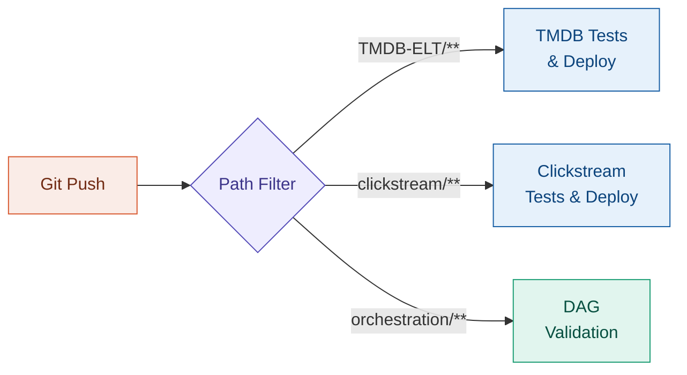

# CI/CD Pipelines

<span class="hp-badge hp-badge--active" style="font-size: 0.75rem;">Active</span>

> GitHub Actions workflows with path filters for multi-project repo

## Overview

<!-- TODO: Describe your CI/CD strategy -->
Explain how you handle CI/CD across a monorepo with multiple data engineering projects.

## Architecture



## Workflow Examples

<!-- TODO: Add your actual workflow YAML -->

```yaml
# Example: path-filtered workflow
name: TMDB Pipeline CI
on:
  push:
    paths:
      - 'TMDB-ELT/**'
  pull_request:
    paths:
      - 'TMDB-ELT/**'
```

## Lessons Learned

<!-- TODO: What patterns worked well for monorepo CI/CD? -->

---

:octicons-mark-github-16: [View on GitHub](https://github.com/Hari-prasanna/Data-Analytics-engineering-portfolio/tree/main/.github/workflows){ .md-button }
