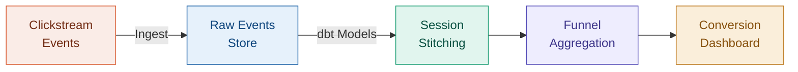

# Clickstream Conversion Pipeline

<span class="hp-badge hp-badge--progress" style="font-size: 0.75rem;">In progress</span>

> Real-time conversion funnel analytics from raw clickstream events

## Overview

<!-- TODO: Add your project overview here -->
Describe the conversion funnel problem, what clickstream data looks like, and goals.

## Architecture



## Tech Decisions

<!-- TODO: Explain your dbt model structure, scheduling strategy, etc. -->

!!! info "Why dbt for transformations?"
    Explain the dbt model layers and testing strategy.

## Code Walkthrough

<!-- TODO: Add key SQL / dbt model snippets -->

```sql
-- Example: funnel staging model
-- Add your actual code here
```

## Current Status

<!-- TODO: What's done, what's left? -->

!!! warning "Work in progress"
    List remaining tasks and next milestones.

---

:octicons-mark-github-16: [View on GitHub](https://github.com/Hari-prasanna/Data-Analytics-engineering-portfolio/tree/main/clickstream-conversion-pipeline){ .md-button }
