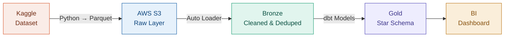

# Shopstream: Clickstream Conversion Pipeline

<span class="hp-badge hp-badge--progress" style="font-size: 0.75rem;">In progress</span>

> Enterprise-grade pipeline turning raw e-commerce clickstream events into business-ready conversion funnel analytics.

## Overview

Raw Kaggle clickstream events (view, cart, checkout, purchase) are converted to Parquet format and landed in **AWS S3**. From there, **Databricks** and **dbt** process the data through a **Medallion Architecture** (Bronze → Silver → Gold) to power downstream BI dashboards.

**Business questions this pipeline answers:**

- **Conversion Funnel:** At what exact stage (View → Cart → Checkout → Purchase) are users dropping off?
- **Product Performance:** Which categories generate high views but low conversions?
- **Session Analytics:** How does session duration correlate with successful purchases?

## Architecture



**Data Flow:**

1. **Ingestion (Python → S3):** Custom script extracts raw dataset, converts to Parquet for compression, and loads into an S3 bucket.
2. **Raw Layer:** Databricks Auto Loader / external tables read Parquet files directly from S3.
3. **Bronze Layer:** Data is deduplicated, timestamps standardized, and surrogate keys generated.
4. **Gold Layer:** Dimensional models (`dim_users`, `dim_products`) and fact tables (`fct_session_funnel`) built for direct querying.

## Tech Decisions

!!! info "Why Medallion Architecture?"
    Separating raw, cleaned, and business layers ensures data quality is enforced progressively. Bronze handles deduplication, Gold delivers query-ready star schema tables — no transformation logic leaks into the BI layer.

!!! info "Why dbt for transformations?"
    dbt's incremental models only process newly landed S3 files, avoiding full historical scans. Combined with `md5()` surrogate keys on `user_session`, `user_id`, `product_id`, `event_type`, and `event_time`, this ensures deterministic deduplication and efficient upserts.

## Key Engineering Highlights

### Cloud Security & IAM

Configured AWS IAM Roles with strict least-privilege policies for Databricks → S3 access. No hardcoded credentials anywhere in the pipeline.

### Service Principals for CI/CD

Replaced vulnerable Personal Access Tokens (PATs) with **Databricks Service Principals** for secure, machine-to-machine authentication in GitHub Actions deployments.

### Delta Lake Optimization

Applied `ZORDER` clustering on frequently filtered columns and `VACUUM` policies to optimize file sizes and skip irrelevant data during BI queries.

### Data Governance

Utilized **Databricks Unity Catalog** to implement **Dynamic Data Masking (DDM)**, ensuring PII is hidden from unauthorized users.

## Repository Structure

```text
clickstream-conversion-pipeline/
├── kaggle_s3_ingestion.py       # Raw data → Parquet → S3
├── shopstream_dbt/
│   ├── models/
│   │   ├── staging/             # Bronze → Silver transformations
│   │   └── gold/                # Silver → Gold business logic
│   └── dbt_project.yml
├── databricks_infra/
│   ├── setup_catalog.sql        # Unity Catalog setup
│   ├── Ingesting.ipynb          # S3 → Bronze ingestion
│   └── PPI_DDM_practice.sql     # Dynamic Data Masking
└── README.md
```

## Current Status

!!! warning "Work in progress"
    - [x] S3 ingestion pipeline
    - [x] Bronze layer (dedup + surrogate keys)
    - [x] Unity Catalog & Delta Lake setup
    - [x] Dynamic Data Masking implementation
    - [ ] Gold layer dbt models (dim/fact tables)
    - [ ] BI dashboard integration
    - [ ] End-to-end GitHub Actions CI/CD

---

:octicons-mark-github-16: [View on GitHub](https://github.com/Hari-prasanna/Data-Analytics-engineering-portfolio/tree/main/clickstream-conversion-pipeline){ .md-button }
