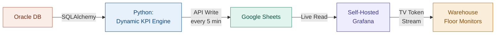

# Internal Transport: Real-Time KPI Dashboard

<span class="hp-badge hp-badge--work" style="font-size: 0.75rem;">Production</span>

> Replaced a €10,000 vendor proposal with an in-house, zero-credential TV dashboard running at under €70/month.

## Overview

The warehouse floor at Ludwigsfelde (LUU) had no real-time visibility into internal transport KPIs. Site leads, team leads, and employees relied on stale CSV reports, shared laptops, or walkie-talkies to understand open orders and transport volumes. External vendor proposals to solve this were estimated at **€10,000+** in implementation costs alone.

I architected a fully in-house solution using a **Databricks** job cluster pushing KPI integers to **Google Sheets** every 5 minutes, with a **self-hosted Grafana** instance streaming the data to zero-credential TV monitors on the warehouse floor.

## Architecture



**Design Principles:** Highly resilient, extremely cost-effective, and fully dynamic. Google Sheets acts as a free, instantly updating intermediary database — no traditional data warehouse costs required.

## Dashboard Preview


## Business Impact

| Metric | Before (Manual) | After (Automated) |
| :--- | :--- | :--- |
| **Implementation Cost** | €10,000+ (Vendor) | **€0 (Built In-House)** |
| **Monthly Infra Cost** | N/A | **< €70/month** |
| **Data Freshness** | Stale CSV reports | **Live (5-min intervals)** |
| **Floor Visibility** | None (laptop/walkie-talkie) | **Passive TV Monitors** |
| **Adding New KPIs** | Code changes required | **Drop a .sql file** |

!!! success "Impact by Role"
    - **Site Leads:** Instant high-level transparency (e.g., 2 open orders, 45 open positions at a glance).
    - **Team Leads:** Dynamic workload distribution based on live traffic instead of delayed reports.
    - **Employees:** Passive awareness of pending tasks just by looking at floor monitors — no logins, no walkie-talkies.

## Tech Decisions

!!! info "Why Google Sheets as an intermediary?"
    A traditional real-time data warehouse would have added significant monthly cost. Google Sheets acts as a free, instantly updating data layer — Grafana reads it natively via plugin, and the data volume (single-row KPI integers every 5 minutes) fits well within Sheets' limits.

!!! info "Why self-hosted Grafana over Looker Studio?"
    Grafana supports **credential-less TV tokens** — monitors on the warehouse floor display dashboards without exposing any login credentials on shared screens. Looker Studio has no equivalent feature for unattended displays.

!!! info "Why a while-loop instead of scheduled jobs?"
    A 5-minute Cron schedule would spin up and tear down a Databricks cluster 288 times per day. A single long-running job with `time.sleep(300)` keeps one minimal cluster alive during operating hours, drastically reducing DBU costs.

## Technical Deep Dive

### Dynamic KPI Engine (Zero-Maintenance)

The Python script does not hardcode any SQL queries. It targets a specific directory (`SQL_FOLDER`) and auto-discovers new KPIs:

- Any `.sql` file dropped into the folder is automatically detected on the next 5-minute cycle.
- The **file name** becomes the column header in Google Sheets (e.g., `open_orders.sql` → `open_orders`).
- Each query returns a single KPI integer — extracted and appended to the results array.
- **Zero code changes required** to add a new KPI to the dashboard.

### Cost-Optimized Compute Loop

The Databricks cluster is heavily tuned for cost efficiency:

- **Minimal Resources:** Operates on average using **<70% memory** and **<60% CPU minutes**.
- **5-Minute Intervals:** `while True` loop with `time.sleep(300)` pause, updating Google Sheets exactly every 5 minutes.
- **Automated Shutdown:** Using `pytz` for Berlin local time, the loop detects end of the final shift (**11:30 PM**) and breaks intentionally — safely shutting down compute overnight to save DBUs.

### Zero-Credential Visualization

- Grafana reads KPI values directly from Google Sheets via the Sheets data source plugin.
- Warehouse monitors use secure **TV tokens** — no login, no credentials on shared screens.

## Setup

### Adding a New KPI

```text
1. Write a SQL query returning a single number (e.g., COUNT(*))
2. Save as a .sql file (e.g., open_orders.sql)
3. Upload to the Databricks SQL_FOLDER
4. Script picks it up on the next 5-min cycle → pushes new column to Sheets
5. Add a new Grafana panel pointing to the new column
```

### Secrets Management

```bash
# Create scope
databricks secrets create-scope luu_transport_secrets

# Oracle credentials
databricks secrets put-secret luu_transport_secrets oracle_auth \
  --string-value '{"user":"<USER>","password":"<PASS>","host":"<HOST>","port":"<PORT>","service":"<SERVICE>"}'

# Google Service Account
databricks secrets put-secret luu_transport_secrets google_auth \
  --string-value '<YOUR_ENTIRE_GOOGLE_SERVICE_ACCOUNT_JSON_HERE>'
```

!!! warning "Linux/Mac Users"
    When pasting URLs or passwords with special characters (`&`, `?`), wrap the value in single quotes (`'`). Otherwise the terminal truncates the string and the script fails silently.

---

:octicons-mark-github-16: [View on GitHub](https://github.com/Hari-prasanna/Data-Analytics-engineering-portfolio/tree/main/work-related/internal-transport-kpi-dashboard){ .md-button }
