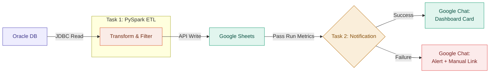

# Oracle → Sheets → Looker ETL

<span class="hp-badge hp-badge--work" style="font-size: 0.75rem;">Work</span>

> Databricks-based ETL pipeline replacing **100 min/day** of manual work with a fully autonomous data sync.

<div class="hp-pills" markdown>
<span class="hp-pill hp-pill--eng">PySpark</span>
<span class="hp-pill hp-pill--eng">Databricks</span>
<span class="hp-pill hp-pill--lang">Python</span>
<span class="hp-pill hp-pill--infra">Oracle JDBC</span>
<span class="hp-pill hp-pill--bi">Google Sheets API</span>
<span class="hp-pill hp-pill--bi">Google Chat</span>
</div>

!!! failure "The problem"
    Warehouse operations teams at Ludwigsfelde (LUU) spent **100 minutes per day** manually extracting heavy reports (>70MB) from the legacy TGW Infosystem and importing them to Google Sheets to track dangerous goods. Browser crashes, AppScript execution limits, and stale data were daily issues.

## Architecture

The pipeline uses **Databricks Workflows** with task dependencies — the notification task only runs after ETL completes, inheriting the run metrics.


## Impact

| Metric | Before (Manual) | After (Automated) |
| :--- | :--- | :--- |
| **Update time** | 100 mins/day | **< 10 mins/day** |
| **Reliability** | Prone to human error | **99.9% uptime** |
| **Data freshness** | Stale by hours | **Real-time (shift start)** |
| **Manual effort** | High (repetitive) | **Zero (fully autonomous)** |

!!! success "Downstream impact"
    Powers the DG Monitor Dashboard, ensuring strict adherence to the 20-Liter threshold for dangerous goods storage.

## Technical deep dive

### 1. Distributed processing (PySpark)

Moved from Pandas to **PySpark** for scalability and faster processing.

- **Optimized reads**: JDBC queries raw inventory data directly from Oracle
- **Transformation**: Spark DataFrames with regex-based filtering (`^\d`) to clean the dataset before visualization
```python
# JDBC read from Oracle
df = (spark.read
    .format("jdbc")
    .option("url", jdbc_url)
    .option("dbtable", query)
    .option("user", dbutils.secrets.get("oracle_credentials", "user"))
    .option("password", dbutils.secrets.get("oracle_credentials", "pass"))
    .load()
)

# Regex filter for valid inventory rows
df_clean = df.filter(F.col("material_id").rlike(r"^\d"))
```

### 2. Job orchestration & dependencies

The pipeline is a **multi-task Databricks Workflow**, not a standalone script:

- **Task 1 (ETL)**: Heavy lifting — extract, transform, load. If it fails, the workflow stops to prevent bad data.
- **Task 2 (Notifier)**: Dependent task that fetches `row_count` and `status` from Task 1 via `dbutils.jobs.taskValues`.
```python
# Task 2 reads metrics from Task 1
row_count = dbutils.jobs.taskValues.get(
    taskKey="etl_task",
    key="row_count"
)
status = dbutils.jobs.taskValues.get(
    taskKey="etl_task",
    key="status"
)
```

### 3. Adaptive ChatOps notifications

Custom notification system using **Google Chat Cards V2** that adapts UI based on job status:

=== "✅ Success state"

    - **Layout**: Column widget — "Run Time" and "Rows Processed" side-by-side
    - **Action**: Direct link to Looker Studio Dashboard

=== "❌ Failure state"

    - **Layout**: Error header with warning icon
    - **Action**: "Call to Action" button linking to the Manual Import Sheet — ensures operations continue even if automation fails

## Setup & configuration

!!! info "Environment"
    Databricks Workspace (Standard/Premium) with Spark Cluster (Runtime 12.2 LTS+)

**Secrets management:**

- `oracle_credentials` — stored in Databricks Secrets scope
- `google_service_account` — JSON key for Google Sheets API auth

**Schedule:**
```cron
0 0 5,15 * * ?  # Runs daily at 05:00 and 15:00 Berlin Time
```

---

:octicons-mark-github-16: [View on GitHub](https://github.com/Hari-prasanna/Data-Analytics-engineering-portfolio/tree/main/work-related/oracle-sheets-looker-etl){ .md-button }