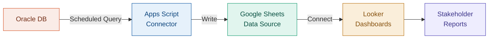

# Oracle → Sheets → Looker ETL

Work

> Automated Oracle DB to Google Sheets sync powering Looker dashboards

## Overview

<!-- TODO: Add your project overview — keep work-appropriate, anonymize as needed -->
Describe the business need, data flow, and how this pipeline supports reporting.

## Architecture

## Tech Decisions

!!! info "Why Google Sheets as an intermediary?"
    Explain the constraints that led to this architecture and the tradeoffs.

## Key Metrics

<!-- TODO: Add impact metrics -->

- **Data freshness**: How often does it sync?
- **Rows processed**: Scale of data
- **Stakeholders served**: Who uses the dashboards?

## Lessons Learned

<!-- TODO: What would you do differently in a greenfield scenario? -->

---

:octicons-mark-github-16: [View on GitHub](https://github.com/Hari-prasanna/Data-Analytics-engineering-portfolio/tree/main/work-related/oracle-sheets-looker-etl){ .md-button }
