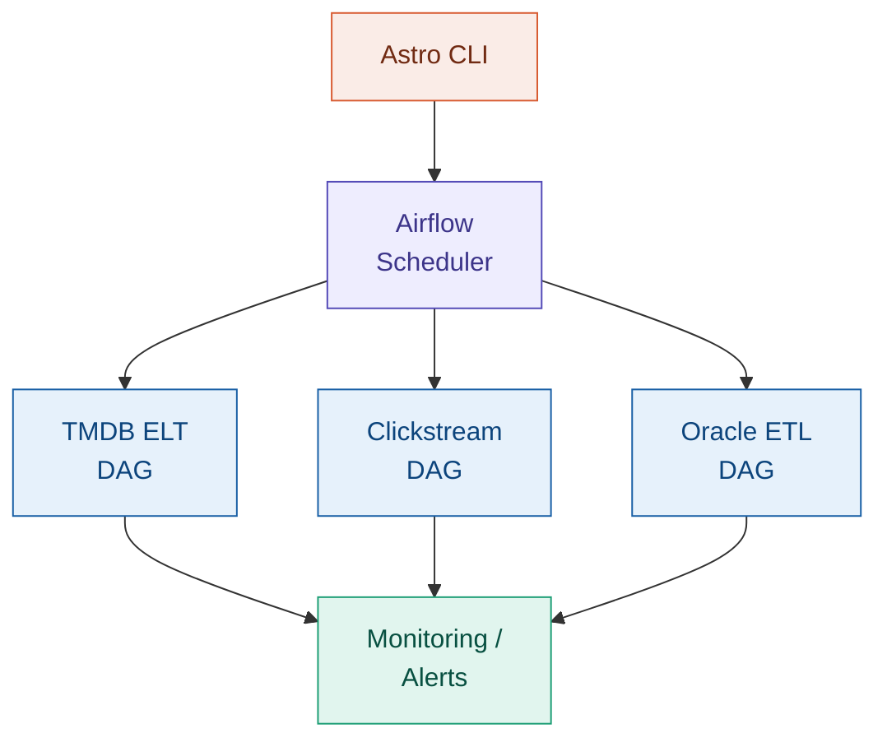

# Orchestration Framework

<span class="hp-badge hp-badge--infra" style="font-size: 0.75rem;">Infra</span>

> Centralized pipeline orchestration with Astro CLI methods

## Overview

<!-- TODO: Add your project overview here -->
Describe why you built a centralized orchestration layer and how it ties your projects together.

## Architecture



## Tech Decisions

!!! info "Why Astro CLI?"
    Explain your choice of Astronomer's CLI for local Airflow development and deployment.

## Setup Guide

<!-- TODO: Add setup steps -->

```bash
# Example: getting started
astro dev init
astro dev start
```

## Lessons Learned

<!-- TODO: What did you learn about orchestration at scale? -->

---

:octicons-mark-github-16: [View on GitHub](https://github.com/Hari-prasanna/Data-Analytics-engineering-portfolio/tree/main/orchestration){ .md-button }
