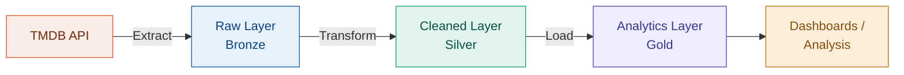

# TMDB ELT Pipeline

<span class="hp-badge hp-badge--done" style="font-size: 0.75rem;">Completed</span>

> Cloud data lakehouse migration with Delta Lake and Unity Catalog

## Overview

<!-- TODO: Add your project overview here -->
Describe the business problem, what data you're working with, and the goals of this pipeline.

## Architecture



## Tech Decisions

<!-- TODO: Explain why you chose each tool -->

!!! info "Why Databricks + Delta Lake?"
    Explain your rationale for choosing Databricks over alternatives, and why the medallion architecture (bronze/silver/gold) made sense.

## Code Walkthrough

<!-- TODO: Add key code snippets -->

```python
# Example: your extraction logic
# Add your actual code here
```

## Lessons Learned

<!-- TODO: What did you learn? What would you do differently? -->

!!! tip "Key takeaway"
    Summarize the most important thing you learned from this project.

---

:octicons-mark-github-16: [View on GitHub](https://github.com/Hari-prasanna/Data-Analytics-engineering-portfolio/tree/main/TMDB-ELT){ .md-button }
