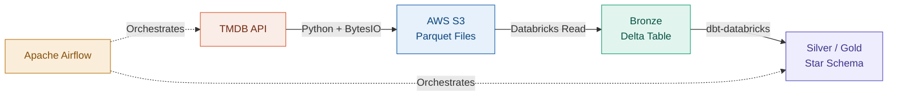

# TMDB Analytics Engine: Local to Cloud Data Lakehouse

<span class="hp-badge hp-badge--done" style="font-size: 0.75rem;">Completed</span>

> End-to-end ELT pipeline extracting movie and financial data from the TMDB API — migrated from a local Postgres warehouse to an enterprise-grade Cloud Data Lakehouse.

> 🔍 [View the Live dbt Data Lineage & Docs](https://hari-prasanna.github.io/Data-Analytics-engineering-portfolio/#!/overview)

## Overview

This project extracts movie and financial data from the **TMDB REST API**, transforms it into a dimensional Star Schema, and serves it for downstream analytics. Originally built on a local PostgreSQL stack, the pipeline was successfully migrated to a cloud architecture decoupling storage (AWS S3) from compute (Databricks) to improve scalability, security, and orchestration.

The entire workflow is protected by a custom **GitHub Actions CI/CD pipeline**.

## Architecture Evolution

### V2: Cloud Data Lakehouse *(Current)*



1. **Extract (Python & S3):** Connects to the TMDB API, handles pagination, and uses `io.BytesIO` buffers to stream data directly into S3 as Parquet — bypassing local disk I/O entirely.
2. **Load (Databricks):** Reads the S3 external location and lands data into a Unity Catalog Bronze layer as a Delta Table.
3. **Transform (dbt-databricks):** Cleans and models raw data into a Star Schema (Silver/Gold layers) using Databricks Serverless compute.
4. **Orchestrate (Apache Airflow):** A containerized Airflow environment manages DAG execution, ensuring extraction and dbt transformations run in sequence.

### V1: Local Modern Data Stack *(Legacy)*

1. **Extract & Load:** Python scripts processed JSON responses via Pandas and loaded into a local PostgreSQL database.
2. **Transform (dbt-postgres):** Modeled Postgres tables into a Star Schema for downstream BI tools.
3. **CI/CD (GitHub Actions):** Automated "Traffic Cop" that spins up a temporary Postgres database, runs extraction, and executes `dbt build` to test code integrity on every Pull Request.

## Tech Decisions

!!! info "Why migrate from Postgres to a Cloud Lakehouse?"
    The local stack worked as a proof-of-concept but hit limits on scalability and collaboration. Decoupling storage (S3) from compute (Databricks) allows independent scaling, and Unity Catalog adds governance that a local Postgres instance can't provide.

!!! info "Why stream with BytesIO instead of writing to disk?"
    The TMDB API returns paginated JSON responses that can grow large. Using `io.BytesIO` buffers with `boto3` streams data directly to S3 without touching the local filesystem — making the ingestion script OOM-proof and removing disk I/O as a bottleneck.

!!! info "Why Dockerized Airflow with BashOperators?"
    A "Clean Room" strategy isolates Python virtual environments per task, preventing dependency conflicts between the extraction scripts and dbt. Containerization ensures the orchestration layer is reproducible across environments.

## Key Achievements

| Achievement | Description |
| :--- | :--- |
| **Cloud Migration** | Separated storage (S3) from compute (Databricks). Configured AWS IAM roles and Databricks External Locations to securely pass data between providers. |
| **OOM-Proof Ingestion** | `io.BytesIO` + `boto3` streams API data directly to S3 with zero local disk usage. |
| **Workflow Orchestration** | Apache Airflow with "Clean Room" `BashOperator` strategy to isolate virtual environments. |
| **CI/CD Optimization** | GitHub Actions with `paths` filtering — only triggers when specific monorepo files change, saving compute time. |
| **Security** | Eliminated hardcoded credentials via strict GitHub Environments isolating DB credentials, AWS keys, and Databricks tokens. |
| **Data Modeling** | Reliable, tested dbt models enforcing data quality rules before the presentation layer. |

## Tech Stack

| Category | Technologies |
| :--- | :--- |
| **Storage** | AWS S3, PostgreSQL *(Legacy)* |
| **Compute & Governance** | Databricks, Unity Catalog, Delta Lake |
| **Transformation** | dbt (`dbt-databricks`, `dbt-postgres`) |
| **Orchestration** | Apache Airflow *(Dockerized)* |
| **CI/CD & Security** | GitHub Actions, GitHub Environments |

## How to Run Locally (V1 Postgres Version)

*The V2 Cloud architecture requires AWS and Databricks workspace access. To run the legacy local version:*

```bash
# Clone and navigate
git clone <repository-url>
cd TMDB-ELT

# Create .env with your credentials
# TMDB_API_KEY, DB_USER, DB_PASSWORD, DB_NAME, DB_HOST, DB_PORT

# Install dependencies
pip install -r requirements.txt

# Run the pipeline
python load_movies.py
cd Movie_data_transformation && dbt build
```

---

:octicons-mark-github-16: [View on GitHub](https://github.com/Hari-prasanna/Data-Analytics-engineering-portfolio/tree/main/TMDB-ELT){ .md-button }
